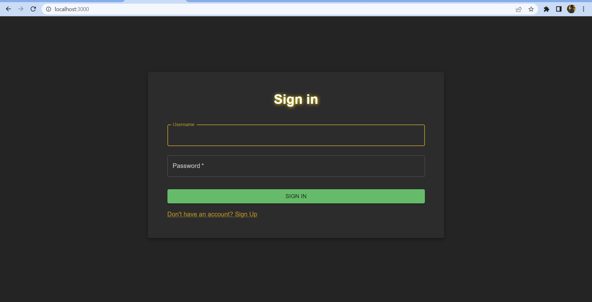
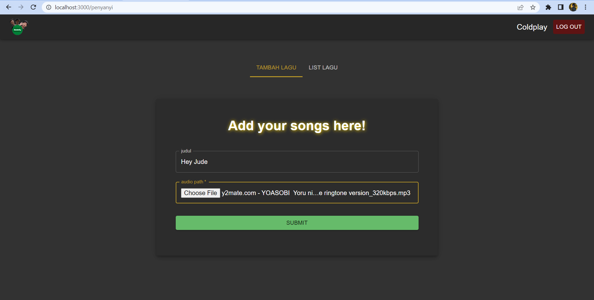

# BONEKIFY PREMIUM APP - Tugas Besar 2 IF3110

This is the repository for the front-end side of the Bonekify Premium App.

Bonekify Premium App is the extension of the original Bonekify App where users manage the premium songs available. Users can register as a singer for the premium songs. Singers can see, add, delete, and edit their songs. Users can also log in as an admin to manage the subscription requests of the plain Bonekify users to the premium singers.

Bonekify Premium is built on React. Data is stored on a MySQL server from the back-end side.

## Table of Contents
- [BONEKIFY PREMIUM APP - Tugas Besar 2 IF3110](#bonekify-premium-app---tugas-besar-2-if3110)
  - [Table of Contents](#table-of-contents)
  - [Requirements](#requirements)
  - [Installation](#installation)
  - [Running the Server](#running-the-server)
  - [Screenshots](#screenshots)
  - [Tasks Allocation](#tasks-allocation)
## Requirements
As the server is running on a Docker container, make sure to first install Docker.
You can choose to install Docker with <a href="https://www.docker.com/products/docker-desktop/">Docker Desktop</a> or a CLI.

However, if you choose to run the server without Docker then you need to install NPM.
You can download NPM through <a href="https://nodejs.org/en/download/.">this link.</a>.
This project also requires Material UI, multer, axios, and universal-cookie library.

## Installation
If you choose to use Docker, then you can first install then run Docker.
To run the server, first build the container. Go to the Bonekify-Config Repository run:
```
docker compose up --build -d bonekify_premium_service
```
The command will build and run the container for the first time.

However, if you choose to run using NPM then you can run 
```
npm install
```
For other dependant libraries, you can install it by running this to the terminal
```
npm install @mui/material @emotion/react @emotion/styled universal-cookie multer axios
```

## Running the Server
There are 2 ways to run this react app.

1. Docker

```
docker compose up
```
The web application will now be up and running. It is now locally accessible through port 1301.
<b><a href="http://localhost:1300/public">http://localhost:1301</a></b>

2. Npm
```
npm start
```
The web application will now be up and running. It is now locally accessible through port 3000.
<b><a href="http://localhost:1300/public">http://localhost:3000</a></b>


## Screenshots





## Tasks Allocation
This project is made by:
- <a href="https://www.linkedin.com/in/ahmad-alfani-handoyo/"> Ahmad Alfani Handoyo (13520023)</a>
- <a href="https://www.linkedin.com/in/saulsayers/?originalSubdomain=id">Saul Sayers (13520094)</a>
- <a href="https://www.linkedin.com/in/rizky-ramadhana-putra-kusnaryanto-6037a51aa/">Rizky Ramadhana Putra Kusnaryanto (13520151)</a>

Halaman | Contributors 
--- | --- 
Routing | 13520094
Login | 13520094 
Register | 13520094 
See Songs | 13520094
Add Songs | 13520094
Delete Songs | 13520094
Edit Songs | 13520094
See Subscription Requests | 13520094
Accept Subscription Requests | 13520094, 13520023
Reject Subscription Requests | 13520094, 13520023


